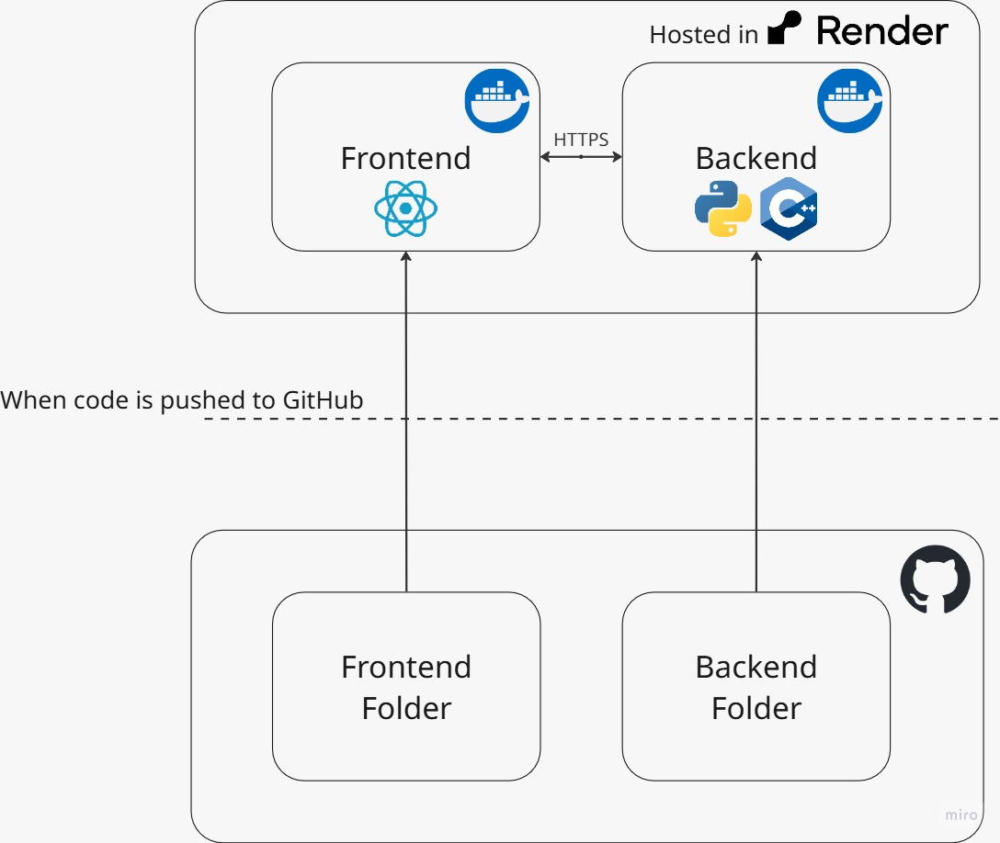

# Local Volatility Trinomial Model - Option Pricing

Computational implementation of the trinomial model with local volatility for pricing European and American options.

## Mathematical Theory

For a detailed explanation of the trinomial model and local volatility, refer to the mathematical documentation:

**[TTPricer.pdf](./TTPricer.pdf)** – Theoretical foundations of the trinomial model and local volatility.

## System Architecture



The system consists of three components that work together:

### 1. Web Interface (Frontend)
A web application where you can:
- Enter model parameters (S₀, K, T, N, r).
- Define the local volatility surface via θ(t) and τ.
- Choose the option type (Call or Put, European or American).
- Visualize pricing results.
- View the generated trinomial tree graphically.
- Calibrate the model to observed market prices.

**Technologies**: React (modern web framework) + Vite (development/build tool).

### 2. Calculation API (Backend)
A server that receives requests from the frontend and orchestrates the calculations.

**Technologies**: Python 3.11 with FastAPI (API framework).

### 3. Numerical Engine (C++)
Optimized implementation of the trinomial algorithm performing the heavy numerical work.
- Written in C++ for maximum computational efficiency.
- Compiled as a shared library that the Python server can invoke.
- Built with `-O3` optimization flag.
- Includes a Nelder‑Mead implementation for calibration.

### Data Flow
1. The user enters parameters in the web interface.
2. The interface sends an HTTP request to the backend.
3. The backend calls the C++ library via `ctypes`.
4. The engine builds the trinomial tree and computes the option price.
5. The backend returns the results as JSON.
6. The interface displays the price and visualizes the trees.

## Hosting on Render
The application is deployed on Render.com. The live frontend is available at:

**https://tmop-front.onrender.com**

The backend API is automatically exposed by Render and is reachable from the frontend via the same domain.

## API Endpoints

### Endpoint `/tree` – Trinomial Tree Calculation
Computes the option price and returns the full price and value trees.

**Method**: POST

**Model parameters**:
- `S0`: Spot price of the underlying asset.
- `K`: Strike price.
- `T`: Time to maturity (years).
- `r`: Risk‑free rate (annualized).
- `N`: Number of trinomial steps.
- `type`: Option type (`"CALL"` or `"PUT"`).
- `isAmerican`: Boolean (`true` for American, `false` for European).
- `Theta`: Array of volatilities `[θ₁, θ₂, …, θₘ]`.
- `tau`: Array of time points `[τ₀, τ₁, …, τₘ]` where `τ₀ = 0` and `τₘ = T`.

**Example request**:
```json
{
  "S0": 100.0,
  "K": 100.0,
  "T": 1.0,
  "r": 0.05,
  "N": 50,
  "type": "CALL",
  "isAmerican": false,
  "Theta": [0.20, 0.25, 0.22],
  "tau": [0.0, 0.4, 0.7, 1.0]
}
```

**Response**:
```json
{
  "price": 10.4506,
  "priceTree": [
    [100.0],
    [110.5, 100.0, 90.5],
    [122.1, 110.5, 100.0, 90.5, 81.9],
    ...
  ],
  "valueTree": [
    [10.45],
    [15.2, 8.3, 4.1],
    [22.1, 15.2, 8.3, 4.1, 0.0],
    ...
  ]
}
```

**Interpretation**:
- `priceTree[i]` contains the underlying asset prices at time step `i`.
- `valueTree[i]` contains the option values at time step `i`.
- Each level `i` has `2i+1` nodes (from `j = -i` to `j = i`).

**Note on size**: The full tree grows quickly; for `N = 50` the tree has 51 levels and 2601 nodes. Visualization is recommended for `N ≤ 10`.

### Endpoint `/calibrate` – Model Calibration
Calibrates the local volatility parameters `θ` to match observed market option prices.

**Method**: POST

**Parameters**:
- `S0`, `r`, `N`, `M` (number of volatility intervals).
- `Theta_initial`: Initial guess for the `θ` values.
- `tau`: Time points `[τ₀, …, τₘ]`.
- `Klist`, `Tlist`, `Vmarket`: Lists of strikes, maturities, and observed market prices.
- `lambda_penalty`: Regularization parameter to penalize extreme volatilities.
- `max_iter`: Maximum number of Nelder‑Mead iterations.
- `tolerance`: Convergence tolerance.

**Example request**:
```json
{
  "S0": 100.0,
  "r": 0.05,
  "N": 50,
  "M": 3,
  "Theta_initial": [0.20, 0.20, 0.20],
  "tau": [0.0, 0.4, 0.7, 1.0],
  "Klist": [95.0, 100.0, 105.0, 100.0, 100.0],
  "Tlist": [1.0, 1.0, 1.0, 0.5, 1.5],
  "Vmarket": [12.5, 10.4, 8.2, 7.1, 13.2],
  "lambda_penalty": 0.01,
  "max_iter": 500,
  "tolerance": 1e-6
}
```

**Response**:
```json
{
  "calibrated_theta": [0.198, 0.245, 0.223],
  "tau": [0.0, 0.4, 0.7, 1.0],
  "message": "Calibration completed successfully"
}
```

## Frontend Features
- Intuitive form for entering model parameters.
- Interactive visualization of the trinomial tree.
- Display of both price and value trees.
- Calibration tool with market data input.
- Responsive design (works on desktops and tablets).
- Smooth animations for a pleasant user experience.

## Technical Notes

### Trinomial Model
- **Accuracy**: Provides higher accuracy than the binomial model for the same number of steps.
- **Convergence**: As `N → ∞`, the price converges to the theoretical Black‑Scholes value.
- **Complexity**: The tree has `(N+1)` time levels with `2N+1` nodes at the final level.
- **American Options**: Supports early exercise at any node.
- **Recommendation**: Use `N ≥ 50` for precise pricing; use `N ≤ 10` for visualizing the tree.

### Local Volatility
- Implements a piecewise‑constant volatility surface σ(S, t) defined by a temporal partition `0 = τ₀ < τ₁ < … < τₘ = T`.
- **Recombination Fix**: Uses a **Fixed Spatial Grid** where the node spacing ($u, d$) is determined by a reference volatility $\sigma_{ref}$ (the time-weighted average volatility).
- **Adaptive Probabilities**: In each time step, the transition probabilities ($p_u, p_m, p_d$) are adjusted based on the local volatility $\sigma(t)$ while keeping the grid fixed. This ensures the tree recombines perfectly even with time-dependent volatility.

### Calibration
- Uses the Nelder‑Mead simplex method.
- **Objective**: Minimize the Mean Squared Error (MSE) between model prices and market prices. It is particularly effective for long-dated instruments, as it incorporates the market's volatility term structure instead of assuming a constant parameter.
- **Regularization**: Penalty term `λ` prevents extreme volatility values.
- **Convergence**: Typically converges within 100‑500 iterations.
- **Tip**: Start with reasonable initial volatilities (e.g., `θᵢ ≈ 0.20`).

### Computational Limits
- Tree visualization is optimized for `N ≤ 15` (the tree contains $(N+1)^2$ total nodes).
- Pure calculations can handle much larger `N` (hundreds of steps).

## Technology Stack

### Numerical Components
- **Engine**: C++17 compiled with `-O3` for performance.
- **Python**: NumPy for array handling.
- **Optimization**: Nelder‑Mead simplex method.

### Interface Components
- **Frontend**: React 18, Vite 5.
- **Charts**: Recharts for data visualization.
- **Animations**: Framer Motion.
- **HTTP Client**: Axios.

### Infrastructure
- **Backend**: FastAPI (Python 3.11).
- **Python‑C++ Bridge**: `ctypes`.
- **Containerization**: Docker (Dockerfile and docker‑compose.yml).
- **Deployment**: Render.com (automatic CI/CD from GitHub).

## Project Structure
```
.
├── backend/
│   ├── api.py                  # FastAPI server with endpoints
│   ├── trinomial.cpp           # Trinomial model implementation
│   ├── trinomial.hpp           # C++ headers
│   ├── trinomial_model.so      # Compiled shared library
│   ├── requirements.txt        # Python dependencies
│   └── dockerfile              # Container configuration
│
├── frontend/
│   ├── src/
│   │   ├── App.jsx            # Main component
│   │   ├── App.css            # Styles
│   │   └── main.jsx           # Entry point
│   ├── package.json           # JS dependencies & scripts
│   ├── vite.config.js         # Vite configuration
│   ├── dockerfile             # Container configuration
│   └── nginx.conf             # Nginx config for production
│
├── TTPricer.pdf                # Mathematical documentation
├── Architecture_diagram.jpeg   # Architecture diagram image
├── docker-compose.yml          # Docker orchestration
└── README.md                   # This file (English version)
```

## Advanced Configuration

### Frontend Environment Variables
Edit `frontend/.env` to change the backend URL:
```env
# Development
VITE_API_URL=http://localhost:8000

# Production (Render)
VITE_API_URL=https://tmop-front.onrender.com
```

### Backend Environment Variables
```bash
# Frontend URL for CORS (used by Render)
FRONTEND_URL=https://tmop-front.onrender.com

# Server port (default 8000)
PORT=8000
```

### Building the C++ Engine
```bash
g++ -shared -fPIC -o trinomial_model.so trinomial.cpp -std=c++17 -O3
```

- `-shared`: creates a shared library.
- `-fPIC`: position‑independent code (required for shared libs).
- `-std=c++17`: uses the C++17 standard.
- `-O3`: maximum compiler optimization.


